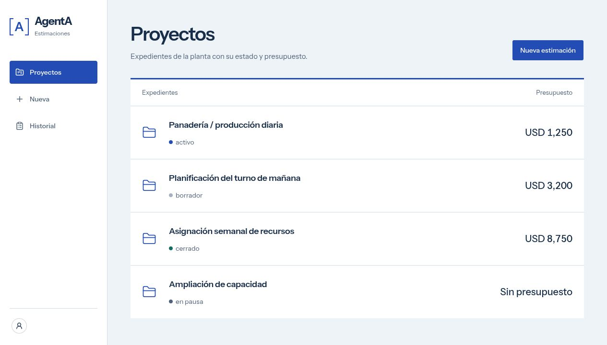
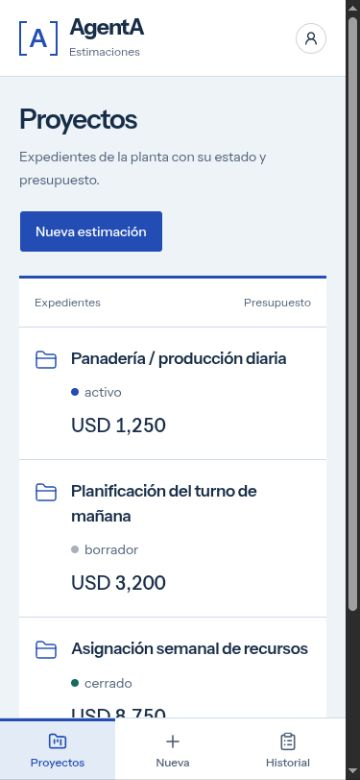
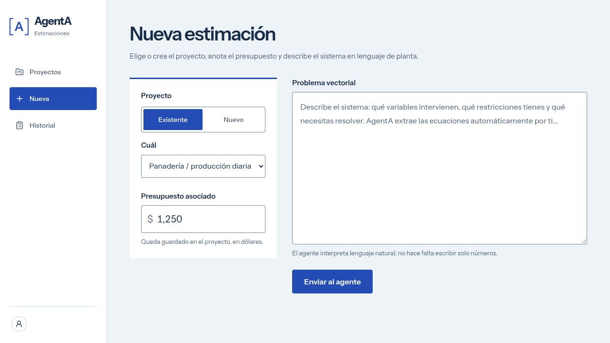
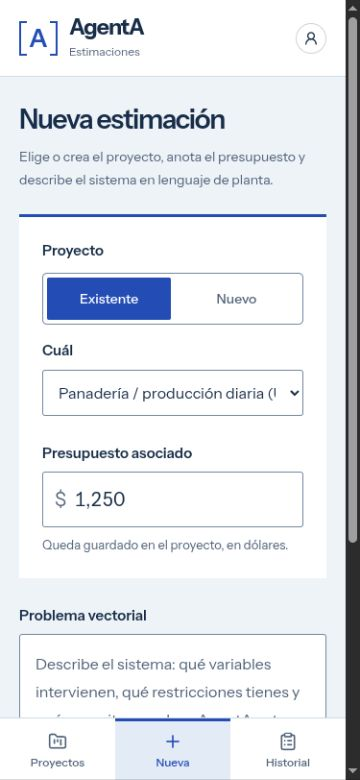
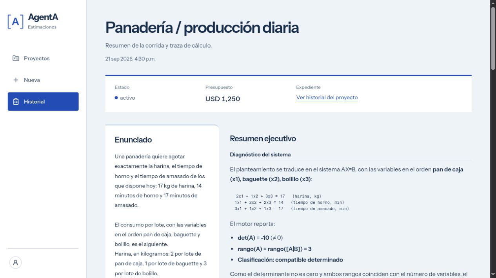
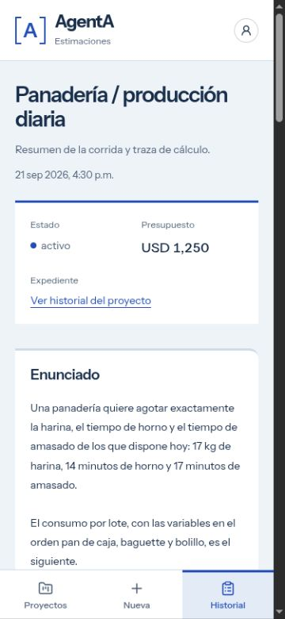
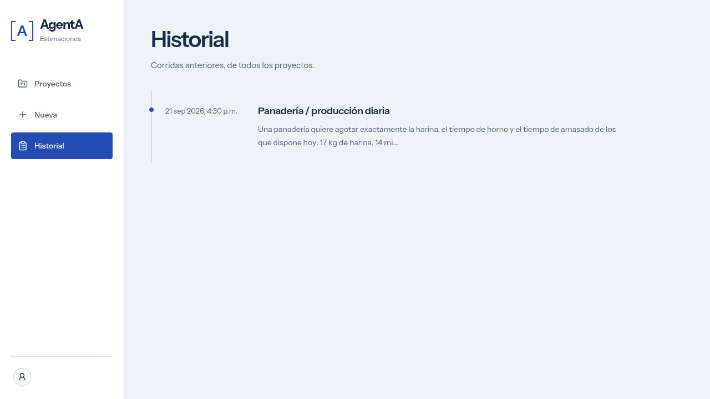
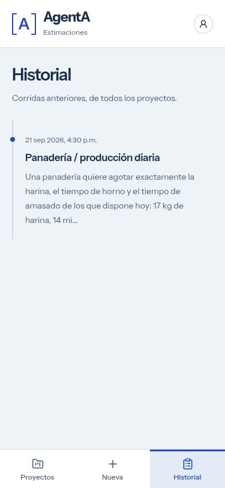
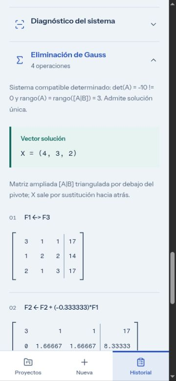
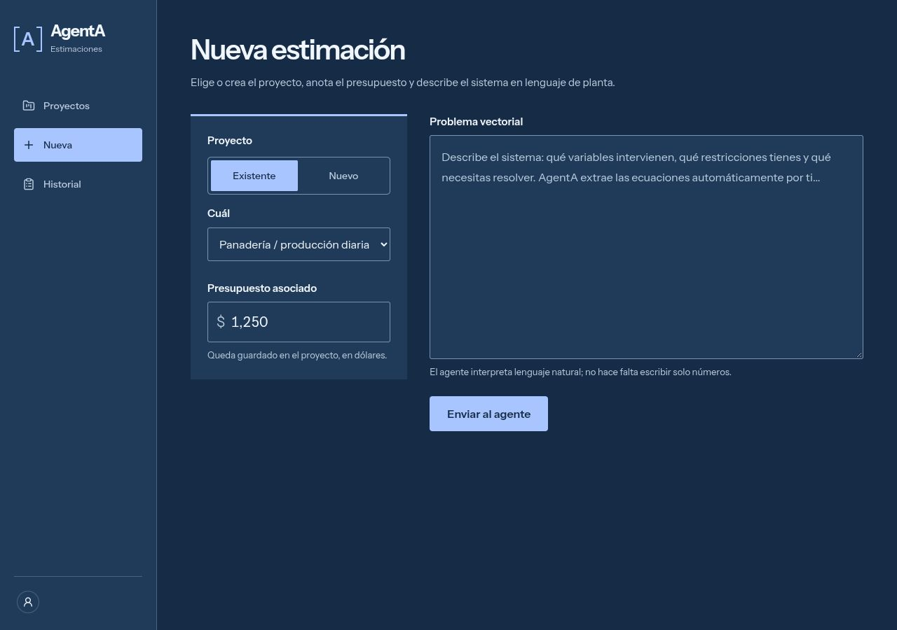

# Verificación visual de DESIGN-1

Este entorno monta las páginas y los componentes reales del frontend, incluido
el formulario interactivo, los resultados, el Markdown y los paneles de cálculo.
Solo sustituye integraciones externas (Clerk, navegación de Next, lectura de API
y Server Actions). No añade rutas, cambios de autenticación ni fixtures a la
aplicación de producción. Las acciones del entorno no envían peticiones al backend.

`panaderia-run.json` es una copia byte por byte del resultado existente en
`/tmp/panaderia-evidence/run.json`: conserva el texto del agente, matrices,
operaciones, diagnóstico y validaciones. El enunciado se extrae sin modificaciones
de `backend/tests/fixtures/panaderia.py`. La solución guardada es `(4, 3, 2)`, con
`det(A) = -10`. Los nombres de proyectos, presupuestos, estados y fecha de portada
son metadatos ilustrativos para revisar la presentación; no son nuevos cálculos.

El servidor escucha exclusivamente en `127.0.0.1:3100`. Los archivos compilados
se mantienen en memoria y los estilos se compilan desde `app/globals.css` al
recargar, por lo que el entorno sigue las ediciones del frontend.

Desde `frontend`, con sus dependencias instaladas:

```bash
node design/verification/serve.mjs
```

Usa `esbuild` instalado en el frontend, una ruta indicada en
`AGENTA_ESBUILD_PATH`, o el runtime de esbuild ya presente en la caché de esta
sesión. Para repetir en una máquina donde no esté disponible, puede instalarse
en un directorio temporal sin modificar dependencias de producción:

```bash
npm install --prefix /tmp/agenta-visual-tools --no-save --package-lock=false esbuild
AGENTA_ESBUILD_PATH=/tmp/agenta-visual-tools/node_modules/esbuild/lib/main.js node design/verification/serve.mjs
```

Pantallas: `/?screen=projects`, `/?screen=new`, `/?screen=result`,
`/?screen=history`. Los enlaces también permiten navegar por las mismas rutas
visibles del producto dentro del servidor aislado. Opciones adicionales:

- `&theme=dark`: tokens oscuros existentes.
- `&panels=open`: abrir todos los pasos de cálculo reales.
- `&state=empty`: estados vacíos de proyectos/historial.
- `&state=error`: presentación de un error de carga de ejemplo.

Las capturas deben tomarse en anchos de 375 y 1280 CSS px. Esperar a que termine
la carga de página/estilos y a `html[data-visual-ready="true"]`. Comprobar foco de
teclado, que el documento no se desborde horizontalmente y que las matrices anchas
se desplacen dentro de su propio contenedor. Las familias se cargan desde Google
Fonts con los mismos nombres y pesos elegidos en el layout del producto.

Este entorno acredita presentación e interacción local de componentes; no
acredita un inicio de sesión real, las Server Actions ni una corrida nueva del
agente. Esas funciones permanecen fuera del alcance de esta fase visual.

## Resultado de la verificación

Revisado el 21 de septiembre de 2026 (hora de El Salvador):

- `npm run build`: aprobado, incluidas tipografías, TypeScript y generación de
  páginas. La primera ejecución sin red falló al descargar Google Fonts; la
  repetición con acceso de red pasó.
- ESLint de todos los archivos TS/TSX/JS modificados y del entorno visual:
  aprobado. `git diff --check`: aprobado.
- `npm run lint` completo: persiste un error previo en
  `components/install-app.tsx:35`, regla `react-hooks/set-state-in-effect`.
  Ese archivo no fue modificado porque su lógica no pertenece a DESIGN-1.
- Las cuatro pantallas se inspeccionaron a 375 y 1280 CSS px. El ancho del
  documento coincidió con el ancho disponible; no hubo desplazamiento
  horizontal de la página. El navegador de captura reserva 15 px cuando
  muestra una barra vertical y devuelve algunas imágenes a 360/1265 px.
  Los nombres de archivo indican el viewport solicitado, no el ancho del JPEG.
- Se probaron proyecto Nuevo/Existente y entrada `001234.567`, que conserva
  su formato funcional `1,234.56`. Ningún envío llegó al backend.
- El foco del presupuesto y textarea mide 3 px y permanece visible. Los
  paneles se abren con Enter y conservan el foco visible de 3 px.
- Gauss, Gauss-Jordan, diagnóstico e inversa se revisaron con datos guardados
  reales. En móvil, las matrices de seis columnas pueden medir hasta 386 px
  dentro de un contenedor de 320 px, con scroll interno; el documento sigue
  limitado al ancho disponible.
- La consulta al vault y las 4/9/9 operaciones de los métodos se conservan.
  La solución es `(4, 3, 2)`, con determinante `-10`.
- Texto secundario: contraste 5.59:1 en claro y 6.97:1 en oscuro. Texto de
  verificación: 5.59:1 y 6.85:1. Alertas: 6.25:1 y 7.06:1. Se mantienen
  títulos explícitos para singularidad e infactibilidad; ambas usan el mismo
  tratamiento de alerta. La captura de alerta usa un error de carga simulado,
  no una corrida singular/infactible nueva.
- `prefers-reduced-motion` desactiva las animaciones y transiciones existentes
  mediante CSS; se verificó la regla en código, sin emulación de preferencia.
- Una comparación AST de los componentes verificó los helpers originales,
  hooks, manejadores y propiedades de validación del formulario. API,
  Server Actions, proxy y `markdown-summary.tsx` no tienen diferencias.

El SHA-256 del resultado copiado coincide byte por byte con el original:
`e5292d1112dcbcc80b40ce4ef0f8bb87d048c7c7c58e6d6e38abc5a1d7e17227`.

## Capturas de las cuatro pantallas

Proyectos: [escritorio](captures/proyectos-1280.jpg) y [móvil](captures/proyectos-375.jpg).





Nueva estimación: [escritorio](captures/nueva-1280.jpg),
[móvil](captures/nueva-375.jpg) y
[formulario completo con foco](captures/nueva-375-completa.jpg).





Resultado: [escritorio](captures/resultado-1280.jpg) y [móvil](captures/resultado-375.jpg).





Historial: [escritorio](captures/historial-1280.jpg) y [móvil](captures/historial-375.jpg).





## Cálculo y tema oscuro

- [Diagnóstico con foco de teclado](captures/diagnostico-panaderia-1280.jpg).
- [Gauss en escritorio](captures/gauss-panaderia-1280.jpg).
- [Gauss en móvil](captures/gauss-panaderia-375.jpg).
- [Gauss-Jordan](captures/gauss-jordan-panaderia-1280.jpg).
- [Inversa y despeje de componentes](captures/inversa-panaderia-1280.jpg).
- [Formulario oscuro](captures/nueva-oscuro-1280.jpg).
- [Alerta oscura en móvil](captures/alerta-oscuro-375.jpg).




